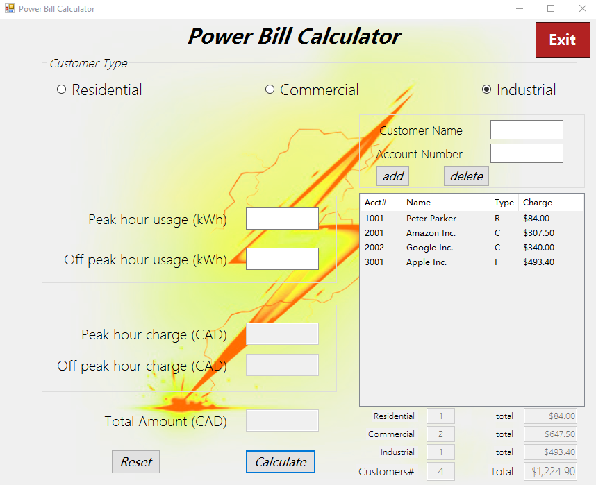
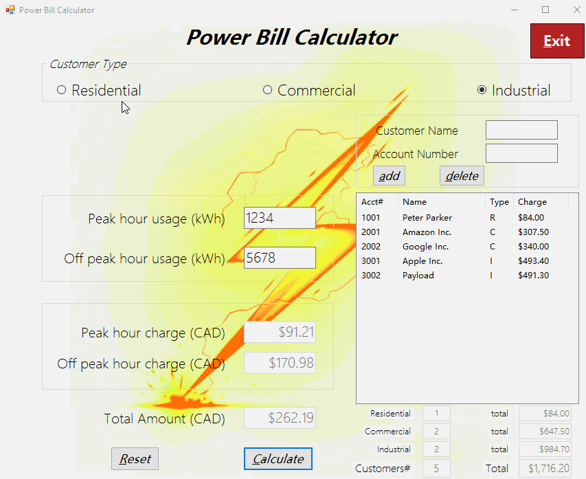
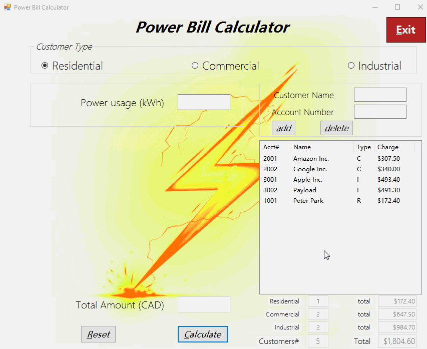
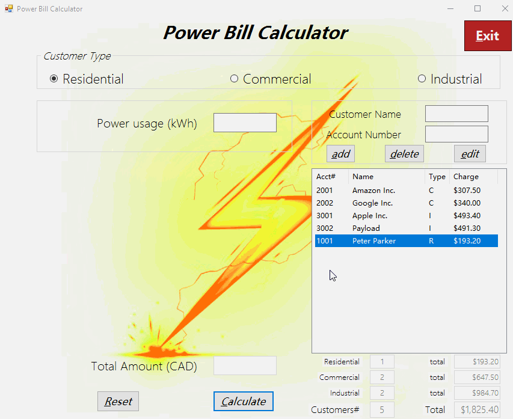

# Power Bill Calculator
## App Overview
<kbd width="70%">
  
</kbd>
<br>
An Windows desktop electricity bill calculator with logging function.

## How to use

### Calculation
</img>

### Add / Delete
</img>

### Edit
</img>

## Output logging file
An customers.txt is auto-generated under directory 
```
PowerBillCalculator\PowerBillCalculator\bin\Debug.
```

## Built With
Microsoft Visual Studio Enterprise 2017

## Author
* **DongMing Hu** - *Initial work* - [hdmdhr](https://github.com/hdmdhr)
